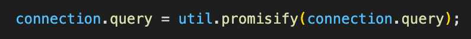
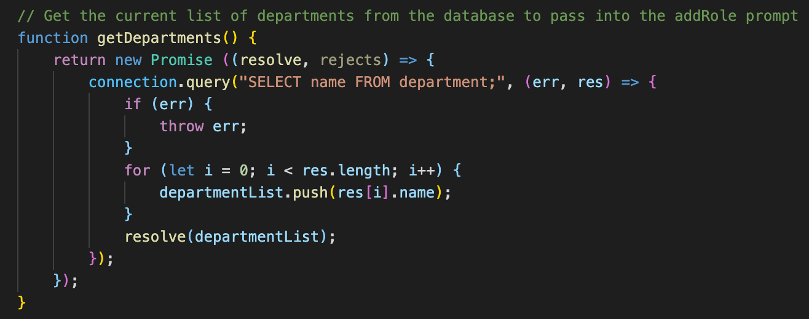
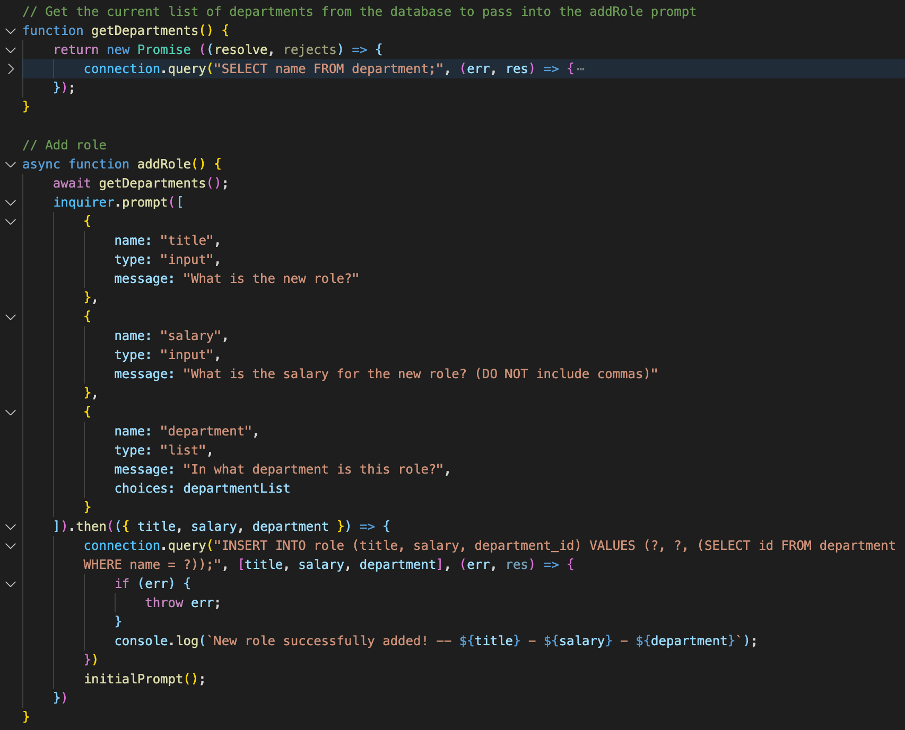
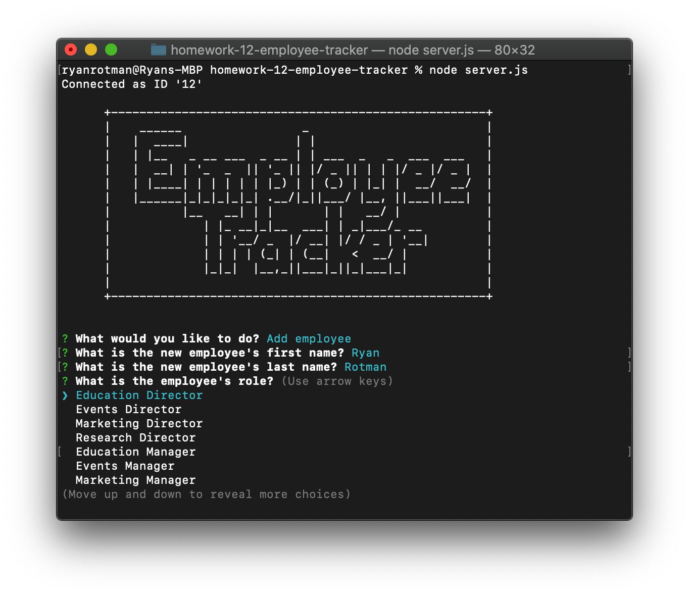
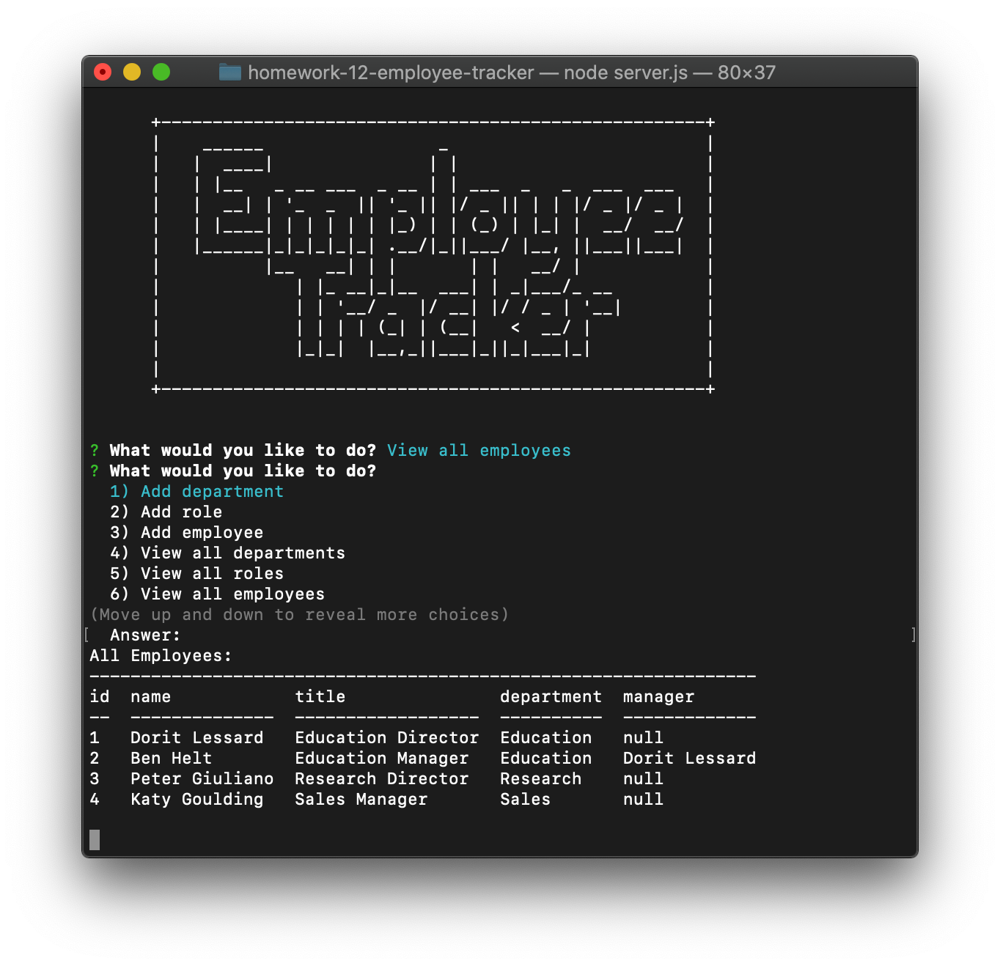

# Homework 12: Employee Tracker

## Description
This repository holds the homework assignment for Week 12 of the [The Coding Boot Camp](https://techbootcamps.utexas.edu/coding/) through the University of Texas at Austin's Center for Professional Education.

The scope of this project is to create a command line application that keeps track of employees for a company. The minimun requirements for this application are to:

- Add deparments, roles, and employees
- View departments, roles, and employees
- Update employee roles

Future development will include these options:

- Update employee managers
- View employees by manager
- Delete departments, roles, and employees
- View the total budget of a department (the combined salaries of all employees in that department)

## Notes
This application uses the following Node.js packages:

- [mysql](https://www.npmjs.com/package/mysql)
- [util](https://nodejs.org/dist/latest-v12.x/docs/api/util.html)
- [inquirer](https://www.npmjs.com/package/inquirer)
- [console.table](https://www.npmjs.com/package/console.table)

To be able to make this application as dynamic as it needs to, the util package was needed to be able to promisify my ```connection.query``` so that additional functions running additional queries could process correctly with the results being passed into the inquirer prompts. Async/await syntax was also needed to make this process correctly.

> 
>
> 
>
> 
>
> 

In addition to utilizing the console.table package to render tables from the database, SQL queries included JOINS, using the CONCAT(), giving columns aliases using AS, and then linking tables using a FOREIGN KEY.

> 

## Instructions
To use this project you will need to clone this [repository](https://github.com/ryanrotman/homework-12-employee-tracker) and then open it in your text editor of choice. You will also need access to a CLI. This projected was created using VSCode and then run in the integrated terminal. Assuming that Node.js is already installed, you will need to run ```npm install``` and then you can run ```node server.js``` to launch the application and proceed through the prompts.

## Usage
<!-- [Here is a video walkthrough of the project.]() -->

## Page Screenshots


## Contributing
Any and all collaboration is welcome so if you have any suggestions or thoughts for new features, please send me an email at ryan.rotman@gmail.com.